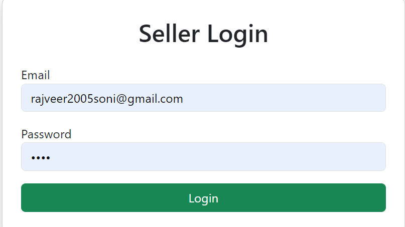
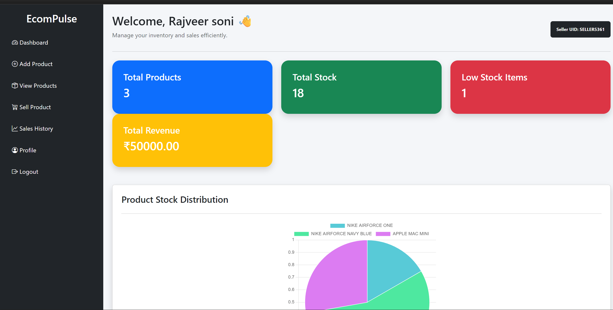
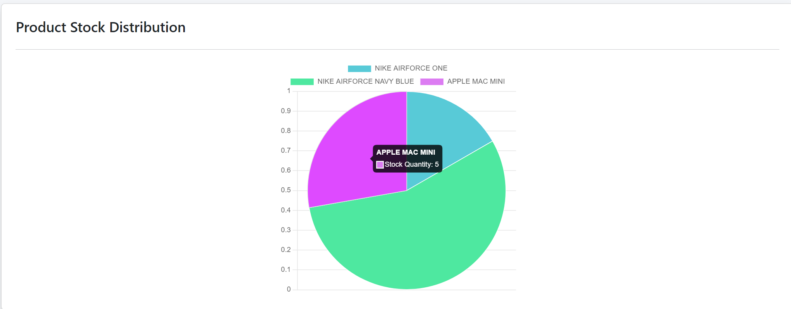
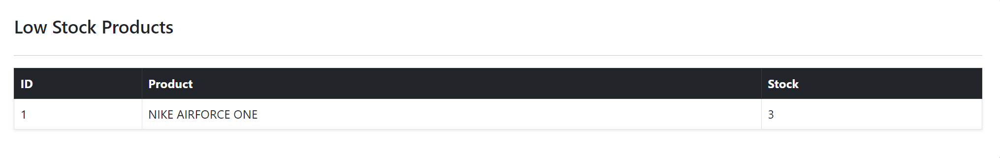
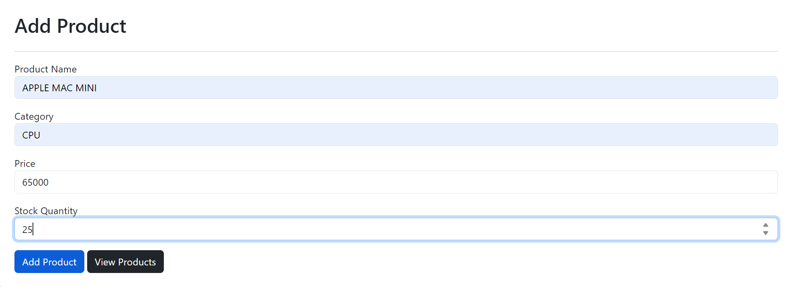
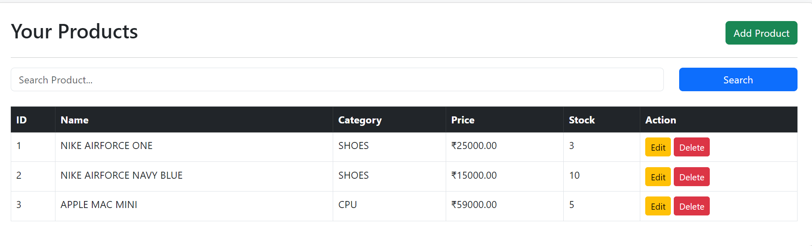
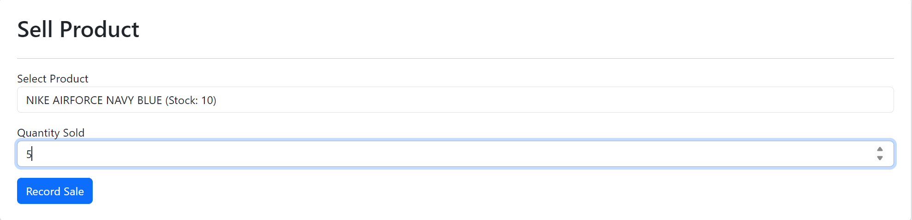
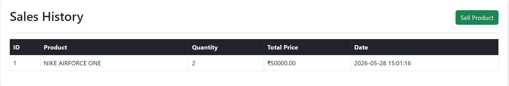
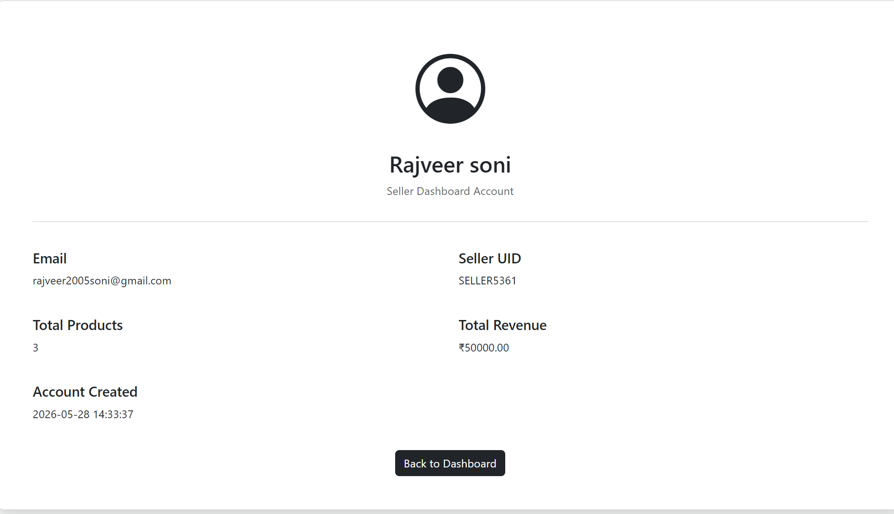
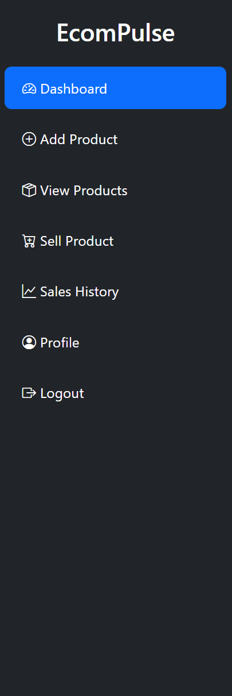

# EcomPulse 🛒

A Seller Inventory & Sales Management Dashboard built using PHP, MySQL, HTML, CSS, JavaScript, Bootstrap, and Chart.js.

EcomPulse helps sellers manage inventory, track sales, monitor revenue, analyze stock distribution, and receive low-stock alerts from a centralized dashboard.

---

## 📸 Project Screenshots

### 🔐 Login Page



---

### 📊 Dashboard Overview



---

### 📈 Product Stock Distribution Analytics



---

### ⚠️ Low Stock Alerts



---

### ➕ Add Product



---

### 📦 View Products



---

### 🛒 Sell Product



---

### 📋 Sales History



---

### 👤 Seller Profile



---

### 🧭 Navigation Sidebar



---

## ✨ Features

### 🔐 Authentication System

- Seller Registration
- Seller Login
- Secure Session Management
- Logout Functionality

### 📊 Dashboard Analytics

- Total Products
- Total Stock
- Low Stock Products
- Total Revenue
- Seller UID Display

### 📦 Product Management

- Add Product
- View Products
- Edit Product
- Delete Product
- Product Search

### 🛒 Sales Management

- Record Product Sales
- Automatic Stock Updates
- Revenue Calculation
- Sales Tracking

### 📈 Analytics

- Product Stock Distribution Chart
- Low Stock Monitoring
- Revenue Tracking

### 👤 Seller Profile

- Seller Information
- Seller UID
- Total Products
- Total Revenue
- Account Creation Date

---

## 🛠️ Technology Stack

### Frontend

- HTML5
- CSS3
- JavaScript
- Bootstrap 5

### Backend

- PHP

### Database

- MySQL

### Visualization

- Chart.js

### Server

- XAMPP Apache Server

---


## 📁 Project Structure

```text
ecompulse/
│
├── auth/
│   ├── login.php
│   ├── signup.php
│   └── logout.php
│
├── config/
│   └── db.php
│
├── dashboard/
│   └── index.php
│
├── products/
│   ├── add.php
│   ├── edit.php
│   ├── delete.php
│   └── index.php
│
├── profile/
│   └── index.php
│
├── sales/
│
├── asset/
│
├── Screenshots/
│
└── README.md
```

---

## 🎯 Future Enhancements

- PDF Invoice Generation
- Export Sales Reports
- Advanced Revenue Analytics
- Product Category Analytics
- Multi-Seller Support
- Email Notifications
- Dark Mode
- GST Invoice Support

---

## 👨‍💻 Author

### Rajveer Soni

B.Tech Computer Science (AIML)


---

## ⭐ Support

If you like this project, consider giving it a ⭐ on GitHub.